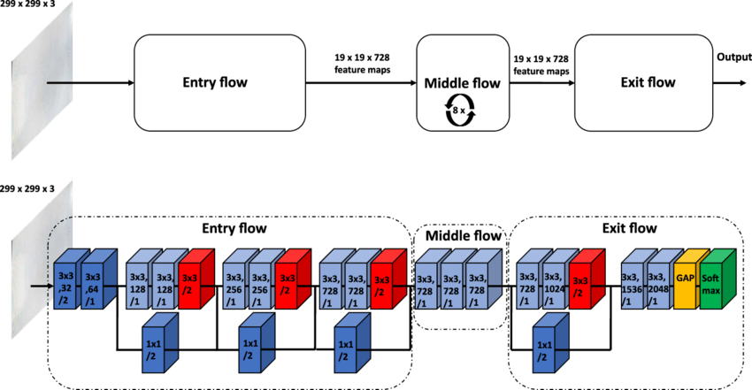

# Dog Breed Identification Using Transfer Learning

[🐶Upload your doggy here🐶](https://xvgnrrrxjup83pmyz5s4jg.streamlit.app/)

by BluedreamV1B3

# The Dataset: Stanford Dogs
The Stanford Dogs dataset has images of 120 dog breeds from around the world.

The contents of the dataset are:
- ***Number of Categories*** = 120
- ***Total Number of images*** = 20,580

The number of images per dog breed is low to train a neural network from scratch.
Hence it would be beneficial to use transfer learning. 
The dataset is imported from tensorflow data.
The data can be found at https://www.tensorflow.org/datasets/catalog/stanford_dogs

More information about the dataset can be found at http://vision.stanford.edu/aditya86/ImageNetDogs/

# Xception
Xception is a convolutional neural network that is 71 layers deep. You can load a pretrained version of the network trained on more than a million images from the ImageNet database . The pretrained network can classify images into 1000 object categories, such as keyboard, mouse, pencil, and many animals. As a result, the network has learned rich feature representations for a wide range of images.
The network is shown below.

# Challenges The network might face

* Small inter-class variations – different breeds could have the same facial features but different colors and vise versa

* Large intra-class variations – the same breed could have different poses and even colors

* A great amount of background variations – photos taken in natural scenes or indoors with or without humans

As you can see Swiss mountain dogs and Bernese Mountain dogs are very similar

# Training and Testing accuracy
After training with 80%-20% training and validation split respectively the results are as follows.
- ***Training accuracy*** = 94%
- ***Testing accuracy*** = 84%

